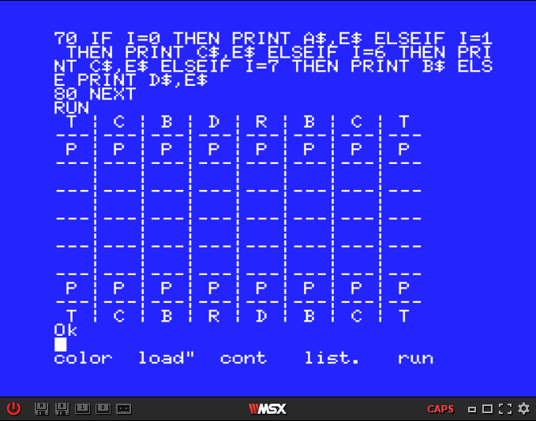

# BASIC_Paulo

- O pseudocódigo e o código em BASIC do programa de xadrez são os seguinte:

  [Pseudocódigo](https://github.com/ProgramacaoEE2020/BASIC_Paulo/blob/master/Codigos/Pseudoc%C3%B3digo_ChessTable.txt)

  [Código](https://github.com/ProgramacaoEE2020/BASIC_Paulo/blob/master/Codigos/ChessTable_BASIC.txt) em BASIC

- Como resultado, obtém-se o seguinte screenshot:

